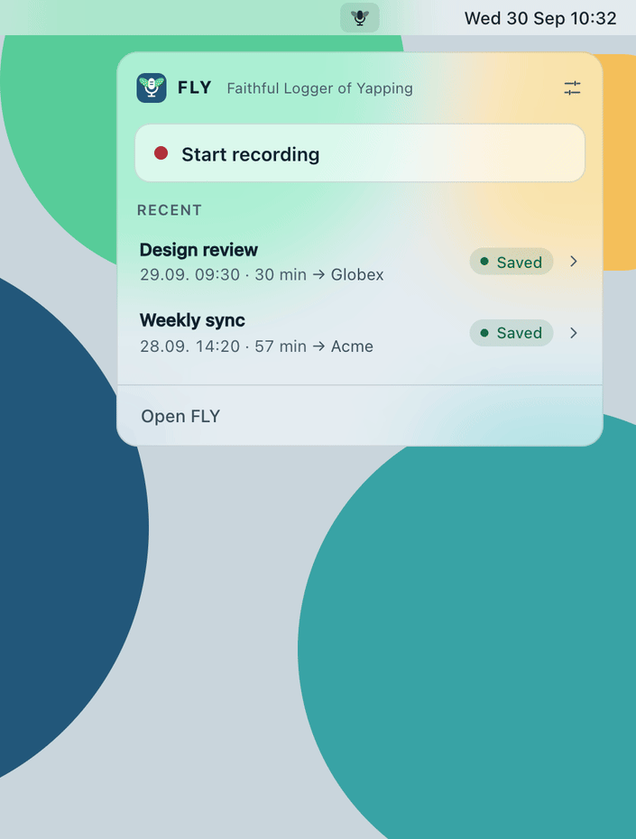

# FLY — Faithful Logger of Yapping


[![Sponsored](https://img.shields.io/badge/chilicorn-sponsored-brightgreen.svg?logo=data%3Aimage%2Fpng%3Bbase64%2CiVBORw0KGgoAAAANSUhEUgAAAA4AAAAPCAMAAADjyg5GAAABqlBMVEUAAAAzmTM3pEn%2FSTGhVSY4ZD43STdOXk5lSGAyhz41iz8xkz2HUCWFFhTFFRUzZDvbIB00Zzoyfj9zlHY0ZzmMfY0ydT0zjj92l3qjeR3dNSkoZp4ykEAzjT8ylUBlgj0yiT0ymECkwKjWqAyjuqcghpUykD%2BUQCKoQyAHb%2BgylkAyl0EynkEzmkA0mUA3mj86oUg7oUo8n0k%2FS%2Bw%2Fo0xBnE5BpU9Br0ZKo1ZLmFZOjEhesGljuzllqW50tH14aS14qm17mX9%2Bx4GAgUCEx02JySqOvpSXvI%2BYvp2orqmpzeGrQh%2Bsr6yssa2ttK6v0bKxMBy01bm4zLu5yry7yb29x77BzMPCxsLEzMXFxsXGx8fI3PLJ08vKysrKy8rL2s3MzczOH8LR0dHW19bX19fZ2dna2trc3Nzd3d3d3t3f39%2FgtZTg4ODi4uLj4%2BPlGxLl5eXm5ubnRzPn5%2Bfo6Ojp6enqfmzq6urr6%2Bvt7e3t7u3uDwvugwbu7u7v6Obv8fDz8%2FP09PT2igP29vb4%2BPj6y376%2Bu%2F7%2Bfv9%2Ff39%2Fv3%2BkAH%2FAwf%2FtwD%2F9wCyh1KfAAAAKXRSTlMABQ4VGykqLjVCTVNgdXuHj5Kaq62vt77ExNPX2%2Bju8vX6%2Bvr7%2FP7%2B%2FiiUMfUAAADTSURBVAjXBcFRTsIwHAfgX%2FtvOyjdYDUsRkFjTIwkPvjiOTyX9%2FAIJt7BF570BopEdHOOstHS%2BX0s439RGwnfuB5gSFOZAgDqjQOBivtGkCc7j%2B2e8XNzefWSu%2BsZUD1QfoTq0y6mZsUSvIkRoGYnHu6Yc63pDCjiSNE2kYLdCUAWVmK4zsxzO%2BQQFxNs5b479NHXopkbWX9U3PAwWAVSY%2FpZf1udQ7rfUpQ1CzurDPpwo16Ff2cMWjuFHX9qCV0Y0Ok4Jvh63IABUNnktl%2B6sgP%2BARIxSrT%2FMhLlAAAAAElFTkSuQmCC)](http://spiceprogram.org/)

**A fully local meeting recorder and transcriber for macOS.** FLY listens to
your microphone **and** your computer's audio while you record, so both your
voice and the other people on a call are captured. No bot joins the meeting. It
runs on local AI models such as Whisper by OpenAI for speech recognition and
pyannote for telling speakers apart, so your meetings never leave your Mac. You
get a transcript that says *who said what*, which you can hand to the AI agent
in your project folder to write the notes. After a one-time model download, no
audio or text is sent anywhere. Tell people when you record; see
[Privacy and consent](#privacy-and-consent).

<p align="center">
  
</p>

```
🎙️ Record mic + computer audio  →  📝 Transcribe  →  👥 Label speakers  →  🏷️ Name them  →  🤝 Hand over to your agent
                                   Whisper large-v3  pyannote                               meeting-inbox-to-note skill
```

A short animated walkthrough is in [`docs/how-it-works.html`](docs/how-it-works.html)
(download it and open it in a browser).

## What you get

- **A menubar recorder.** Click the FLY icon for a small panel: start and stop
  a recording, see your latest recordings and their status, and save the ones
  that are waiting. It captures your microphone and system audio, so remote
  participants are included.
- **Local transcription** with Whisper `large-v3` by OpenAI, running on your
  Mac. This is accurate even for languages that smaller models get wrong, such
  as Finnish.
- **Speaker labels** from pyannote. You give each speaker a real name before
  saving.
- **Saving into projects.** Each transcript lands in a folder your agent works
  in, such as an Obsidian vault or a repo, marked `status: raw`.
- **An agent skill** that turns the raw transcript into a proper note. It checks
  who said what from context, writes in the meeting's language, fixes misheard
  terms and leaves an attribution review for you to spot-check.

There is deliberately **no built-in summary**. A small local model makes
things up, while your own agent has the project context and a stronger model.

## Requirements

- A Mac with Apple Silicon (M1 or later) running **macOS 14.2 or later**
  (needed for system audio capture)
- About **5 GB of disk space**, mostly for the speech models
- An internet connection while installing (afterwards FLY works offline)
- An AI coding agent such as [Claude Code](https://claude.com/claude-code) to
  turn transcripts into notes (optional)

## Install

Run this in your terminal:

```bash
curl -LsSf https://raw.githubusercontent.com/tuomasharkonen-ux/FLY-transcriber/main/install.sh | sh
```

It takes about 5 to 20 minutes, mostly a one-time download of about 3 GB.
FLY transcribes with local AI models, which is how it stays completely offline,
and it needs them to work. Leave the Terminal window open until it says
**FLY is installed**.

The script checks your Mac meets the requirements, explains what it is about
to do, and asks one question: download the speech models **now**
(recommended), or **later**, during your first recording (that transcript then
takes longer and needs an internet connection). Press Enter for now. Then it
works through five numbered steps, each with a dimmed line naming exactly what
it installs:

1. **The tools FLY runs on:** [uv](https://docs.astral.sh/uv/) (into
   `~/.local/bin`, if you don't have it) and
   [ownscribe](https://github.com/paberr/ownscribe), the recording and
   transcription engine (WhisperX + pyannote), as a `uv` tool on Python 3.12.
2. **The FLY app,** as a `uv` tool, from the latest release's source archive.
   It brings its own `ffmpeg`.
3. **The speaker model** (30 MB, checksum-verified) into
   `~/.local/share/fly-transcriber/models/`.
4. **The speech models** (about 3 GB: Whisper `large-v3` and a word-alignment
   model) into `~/.cache/huggingface/`, unless you chose later.
5. **`FLY.app`** in `/Applications` (or `~/Applications` if your account can't
   write there), so Spotlight finds it, and a login item so FLY starts with
   your Mac.

No accounts or tokens are needed. At the end FLY starts and its window opens;
its icon (a microphone with wings) sits in the menubar. If you quit it, open
**FLY** from Spotlight (⌘Space) to bring it back; opening it while it is
running just shows the window.

If something goes wrong, the script ends with **FLY was not fully installed**
after the error. Running the same command again picks up where it stopped.

Options go after `sh -s --`, for example `… | sh -s -- --no-login-item`:

- `--no-login-item`: don't start the app at login.
- `--warmup` / `--no-warmup`: download the speech models now / during your
  first recording, without asking. With no terminal to ask in, it downloads
  them now.
- `FLY_VERSION=v0.2.0` (an environment variable, set before `sh`): install that
  release instead of the latest one. `FLY_VERSION=main` installs unreleased
  work in progress.

The installer installs the latest [release](https://github.com/tuomasharkonen-ux/FLY-transcriber/releases).
If it can't find one, it stops and tells you, rather than installing something
else.

If you'd rather read the script before running it, download
[`install.sh`](install.sh) and run `sh install.sh`.

## First-time setup

### Allow audio access

Your first recording asks for **microphone** and **system audio** access.
Allow both. Without system audio, the other people on a call aren't recorded.

macOS may name the app **python3.12** in these prompts, for example "python3.12
wants to bypass the system's private window picker and access screen and audio
directly". That is FLY: it runs on Python, and macOS shows the name of the
program, not of the app. The wording of that prompt is fixed by macOS.

### Tell it about your vocabulary

Open **Settings** (the sliders icon in the panel) and fill in **Vocabulary
hints**: a comma-separated list of names, products and jargon. Whisper gets
exactly these words wrong, and listing them measurably helps. Hints are applied
when a recording starts, so add them before the meeting. You can also pin the
**Language** instead of relying on auto-detection.

## Using it

1. Click the FLY icon and **Start recording**. The icon turns red and shows a
   timer.
2. **Stop recording** when the meeting ends. Processing starts on its own; the
   icon becomes a waveform and the panel shows progress.
3. When it's done, the icon shows how many recordings are waiting to be saved.
   Open the panel and click the one marked **Save**. Add a title,
   name each speaker (each one is shown with their first line so
   you can tell them apart), pick a project, and save.
4. Ask your agent to process the inbox. The skill turns the transcript into a
   note and deletes the raw file.

Clicking a saved recording opens its transcript in the FLY window. Right-click
the icon for the rest: Add Project, the recordings folder, advanced settings
and Quit.

Processing isn't instant. It runs at about **0.8× realtime**, so a one-hour
meeting takes around 50 minutes, plus speaker detection.

### Projects

A project is a folder where transcripts are saved. Add one in **Settings →
Projects → Add project**, or right when you save your first recording: with no
projects yet, the save form asks where transcripts should go. There are two
options:

- **Create a new project** makes a new folder (named after the project, in your
  home folder unless you choose another place).
- **Use an existing folder**, such as an Obsidian vault or a repository you
  already work in. Pick it with the folder picker.

Either way, FLY adds `meetings/_inbox/` for the transcripts and writes two files
at the project root:

- `CLAUDE.md`: tells the agent what the inbox is and what to watch out for.
- `.claude/skills/meeting-inbox-to-note/SKILL.md`: the step-by-step skill for
  turning a transcript into a note.

Before anything is created, the form lists every folder and file it will add and
marks the ones that already exist. Under **Options** you can change the
transcripts folder, leave out the agent files, and pick the file name and
frontmatter style. Removing a project from FLY only takes it off the list; its
folder and files stay. To add the agent files to a folder without making it a
project, run `fly-transcriber install-agent ~/path/to/your/project`.

Existing `CLAUDE.md` or skill files are never overwritten, so you can tailor
them to your project. Put your note template, folder layout and task format in
`CLAUDE.md`, and the skill follows them.

### About speaker labels

Labels come from voice alone, so treat them as a strong hint rather than a
fact. Short replies ("Yeah.", "Right.") and two people sharing one laptop mic
are the usual sources of mistakes. That's why the agent skill checks every
decision and action item against the text before naming anyone, and lists
every change it made. Speaker names are applied only to the saved copy; the
original transcript keeps its anonymous labels, so a wrong mapping can always
be redone.

## Privacy and consent

Everything stays on your Mac: audio, transcripts and the models that produce
them. The only network traffic is the install itself, including the model
download (or, if you chose to download the models later, that download during
your first recording). If you use a HuggingFace token instead of the bundled
speaker model, FLY also checks the token with HuggingFace before each
recording; no audio or text is sent.

- The app's UI is served on `127.0.0.1` only, and answers only its own pages:
  other websites you visit can't read from it, send it commands or show it
  inside their own pages.
- Your recordings folder and FLY's settings are readable only by your own
  account, not by other accounts on the same Mac.

**Tell people when you record.** In many places, including the EU, you need
participants' consent to record a meeting. It's your responsibility to ask.

## Configuration

| File | What it is |
|---|---|
| `~/.config/fly-transcriber/settings.toml` | App settings, also editable in Settings |
| `~/.config/fly-transcriber/hf_token` | Optional HuggingFace token, only needed without the bundled speaker model |
| `~/.config/fly-transcriber/state.json` | What was saved where, plus the titles and names you typed |
| `~/.config/ownscribe/config.toml` | Generated from settings before each recording; don't edit by hand (a file FLY didn't write is backed up once, as `config.toml.bak-*`) |
| `~/ownscribe/` | Recordings and original transcripts |
| `~/.local/share/fly-transcriber/models/` | The speaker model |
| `~/.cache/huggingface/` | The speech models |

Useful settings:

- `model`: `large-v3` by default. `medium` or `small` are faster but much less
  accurate outside English.
- `keep_recording`: keeps the WAV file (about 300 MB per hour). Off by default.
- `language`: empty to auto-detect, or a code like `"fi"` or `"en"`.

After editing `settings.toml` by hand, use **Advanced → Reload Settings** in the
right-click menu.
`$HF_TOKEN` overrides the token file if set.

## Update

Run the install command again. It quits FLY if it's running (it refuses while a
meeting is being recorded or processed, so nothing is lost), installs the latest
release and starts FLY again. Models already downloaded aren't downloaded
again, and it doesn't ask the download question. Your settings, recordings and
saved state stay.
The version is shown at the bottom of the dashboard, and
`fly-transcriber --version` prints it.

## Uninstall

```bash
curl -LsSf https://raw.githubusercontent.com/tuomasharkonen-ux/FLY-transcriber/main/install.sh | sh -s -- --uninstall
```

This removes the app, `FLY.app`, ownscribe, the speaker model and the login item. Your
settings, recordings and the speech models are kept; delete
`~/.config/fly-transcriber`, `~/ownscribe` and `~/.cache/huggingface` yourself
if you want them gone.

## Known limitations

- **Apple Silicon and macOS 14.2+ only**, because system audio capture relies
  on Core Audio taps.
- **Meetings are named by hand** at saving. An unnamed meeting is saved as
  `28-09-26-meeting-1420.md`.
- **Permission prompts say "python3.12"**, not "FLY", because FLY is not yet a
  packaged, signed Mac app.
- **No macOS notifications** unless the app runs as a signed bundle. The
  menubar icon is the status indicator.

## How it works

The app is a thin front-end for the [ownscribe](https://github.com/paberr/ownscribe)
CLI, which it runs as a subprocess. A few details are worth knowing if you work
on it:

- **Stop sends `SIGINT`.** That ends capture and *starts* processing. Quitting
  during a recording asks first, because that really does discard it.
- **Speaker turns come from ownscribe's JSON, not its markdown.** The markdown
  gives a whole segment to one speaker, which hides turn changes inside it,
  while the JSON keeps a speaker for every word. Segments are split where the
  word-level speaker changes, and single-word flips are ignored as noise.
- **The speaker model is installed locally, so no account is needed.**
  `pyannote/speaker-diarization-community-1` is gated on HuggingFace, but it's
  CC-BY-4.0 and its gate is auto-approved. The installer downloads a copy from
  this repo's releases into `~/.local/share/fly-transcriber/models/`. pyannote
  treats a model name that exists as a folder as a local model *before* it
  contacts the hub, and resolves it against the working directory, so the app
  runs ownscribe from that folder. ownscribe won't diarize without a token, so
  it gets a placeholder that is never sent anywhere. The installer pins
  ownscribe to the version this was tested with. The copy is packaged by
  `scripts/package_speaker_model.sh`.
- **Speaker labels are checked before recording.** When pyannote can't load
  its model, ownscribe still exits successfully with an unlabelled transcript.
  So without a local model, the app checks the gated model up front with a
  `HEAD` on a model file (the metadata API reports success even when access
  hasn't been granted).
- **Summaries were tried and removed.** The local model (`phi-4-mini`) invented
  a decision nobody made and drifted from Finnish into English partway through.
- **The UI is a local web page in a native popover.** The panel and the FLY
  window are `WKWebView`s showing the same Preact UI the app serves on
  `127.0.0.1:8756`, so it can also be opened in a browser. The popover's page is
  transparent, so the system material (Liquid Glass on macOS 26) shows through.
  The folder picker and the token prompt use `osascript`, because a native
  alert's text field can't take focus in a menubar-only app (and a web page
  can't learn a folder's path).

## Development

```bash
git clone https://github.com/tuomasharkonen-ux/FLY-transcriber
cd FLY-transcriber
uv run fly-transcriber                      # run from source
uv run pytest                               # tests
uv run python scripts/dashboard_preview.py  # UI with fake data on :8757 (panel: /popover.html)
uv run --with playwright python scripts/make_demo_gif.py  # re-render docs/demo.gif (needs Chrome)
```

The UI is Preact + htm, vendored in `static/vendor/`, with no build step
and no npm. The tested logic lives in the non-UI modules; see `CLAUDE.md` for an
architecture overview.

### Releasing

The installer installs the latest release. `main` may contain unreleased work
in progress.

To publish a release:

```bash
# 1. set `version` in pyproject.toml (e.g. 0.3.0), then refresh the lockfile
uv lock
git commit -am "Release v0.3.0" && git push
# 2. tag it and publish
git tag v0.3.0 && git push origin v0.3.0
gh release create v0.3.0 --generate-notes
```

Tests run on GitHub for every push (`.github/workflows/tests.yml`); release
from a commit where they passed. Anyone who runs the installer or updates after
that gets `v0.3.0`. Changes to
`install.sh` itself are live as soon as they are on `main` (the install command
fetches it from there), so keep it working with the latest release. The speaker
model has its own release, `speaker-model-v1`, which the installer downloads
separately; its name does not start with `v`, so it is never taken for an app
release.

## Credits

Built on [ownscribe](https://github.com/paberr/ownscribe),
[WhisperX](https://github.com/m-bain/whisperX),
[OpenAI Whisper](https://github.com/openai/whisper),
[pyannote.audio](https://github.com/pyannote/pyannote-audio) and
[PyObjC](https://github.com/ronaldoussoren/pyobjc). The UI bundles
[Preact](https://preactjs.com) (MIT) and [htm](https://github.com/developit/htm)
(Apache-2.0); their licences are in `src/fly_transcriber/static/vendor/`.

The installer downloads pyannote's
[speaker-diarization-community-1](https://huggingface.co/pyannote/speaker-diarization-community-1)
model, redistributed unmodified under
[CC-BY-4.0](https://creativecommons.org/licenses/by/4.0/). Credit for it goes
to [pyannote](https://github.com/pyannote/pyannote-audio). If you use it outside
this app, please get it from the source.

## License

[MIT](LICENSE)
